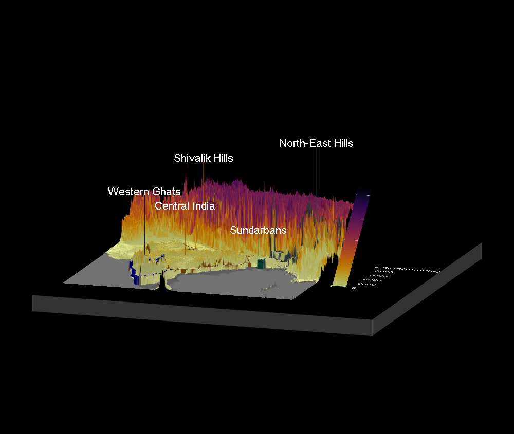
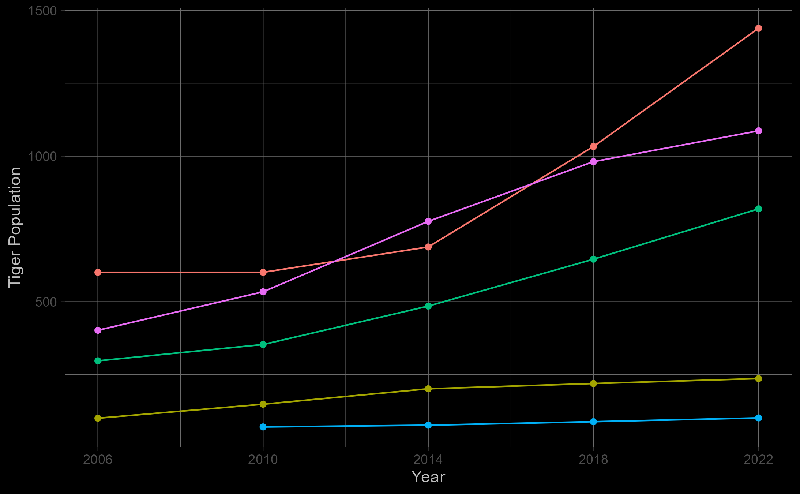

# Tiger Terrains and Timelines: Visualizing India’s Tiger Territories 🐯

## Background
- The recent report on the status of tigers by the National Tiger Conservation Authority (NTCA) of India estimates a significant increase in the tiger population across the country.
- The tiger-populated habitats within the nation have been categorized into 5 landscapes viz.
  - Shivalik Hills and Gangetic Plains,
  - Central Indian and Eastern Ghats,
  - Western Ghats,
  - Northeast Hills and Brahmaputra Flood Plains, and
  - Sundarbans
 
## Aim
- The present work aims to visualize these landscapes as an interactive 3D model using spatial data, and the tiger population using a line plot.

<h3>
<a href="https://tiger-viz.netlify.app/">Check the dashboard now!!</a>
</h3>

## Data
- The [NTCA report](https://ntca.gov.in/assets/uploads/Reports/AITM/status_of_tiger-copredators-2022.pdf) - obtained from [NTCA official website](ntca.gov.in)
- [Spatial data](https://www.diva-gis.org/gdata) of India

## Visualisations (Glimpse!)
- For the 3D plot,
  - the Indian terrain spatial data available online was used.
  - Then, the latitude and longitude coordinates of the landscapes mapped manually using the NTCA report were plotted over the terrain.
  - This mapping process was the most challenging task.
 
<h6 align="center">3D Plot - Perspective 1</h6> 

  

<be>

<h6 align="center">3D Plot - Perspective 2</h6> 

  

<be>

<h6 align="center">3D Plot - Perspective 3</h6> 

  

 

- Further, the tiger population estimates from the report were extracted and presented as a line plot in plotly (the plot below is a static version!).
<h6 align="center">Line Plot</h6> 

 

 

- It can be observed from the plot that there has been an increase in the number of tigers since 2006.
- Hopefully, the conservation efforts will continue to yield much better results. 🤞🤞

